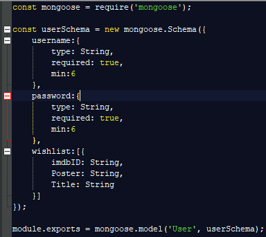
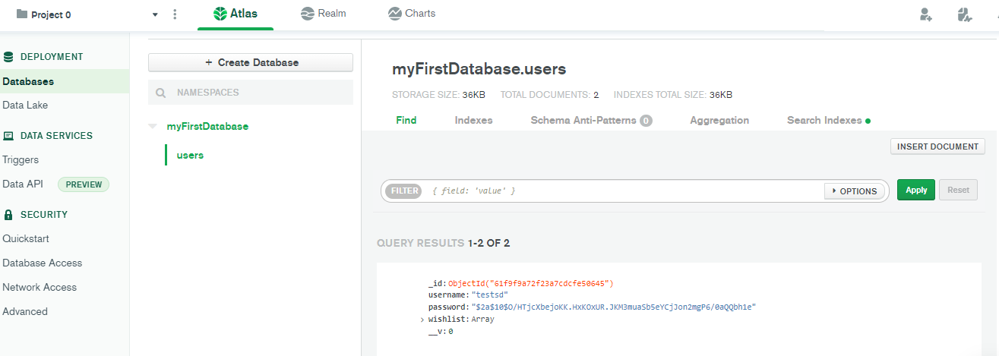

# **Tugas FS(BE+FE) dengan React, Express, Mongodb**

## Anggota Kelompok(ID_GDSC-NAMA-ROLE):
### 46-Raden Surya M.P-Hyper(Hacker, Hipster, Hustler) A.K.A Solo :v

## **Endpoint**
### Registrasi
```bash
POST::http://localhost:4000/user/registrasi
```
### Login(Return token JWT)
```bash
POST::http://localhost:4000/user/login
```
### Ambil Data Wishlist(Masukan Token JWT Hasil dari Login untuk Akses)
```bash
GET::http://localhost:4000/wishlist
```
### Update Data Wishlist(Masukan Token JWT Hasil dari Login untuk Akses)
```bash
PATCH::http://localhost:4000/user/wishlist
```

## **Struktur DB**
### Schema

### Mongodb Atlas
